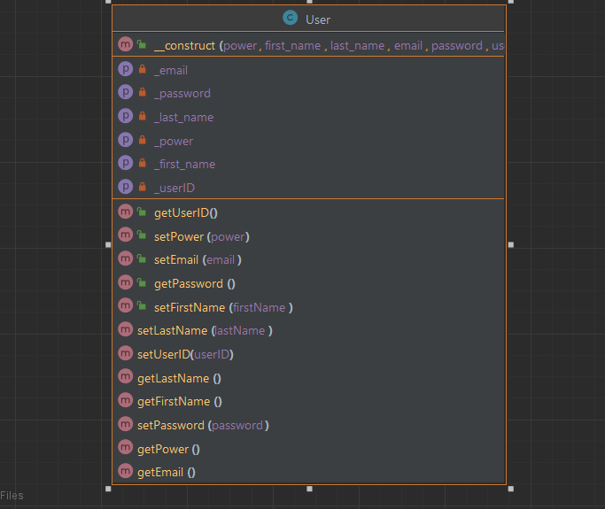
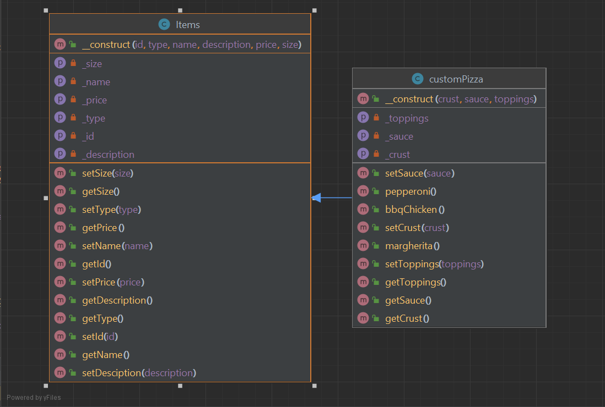
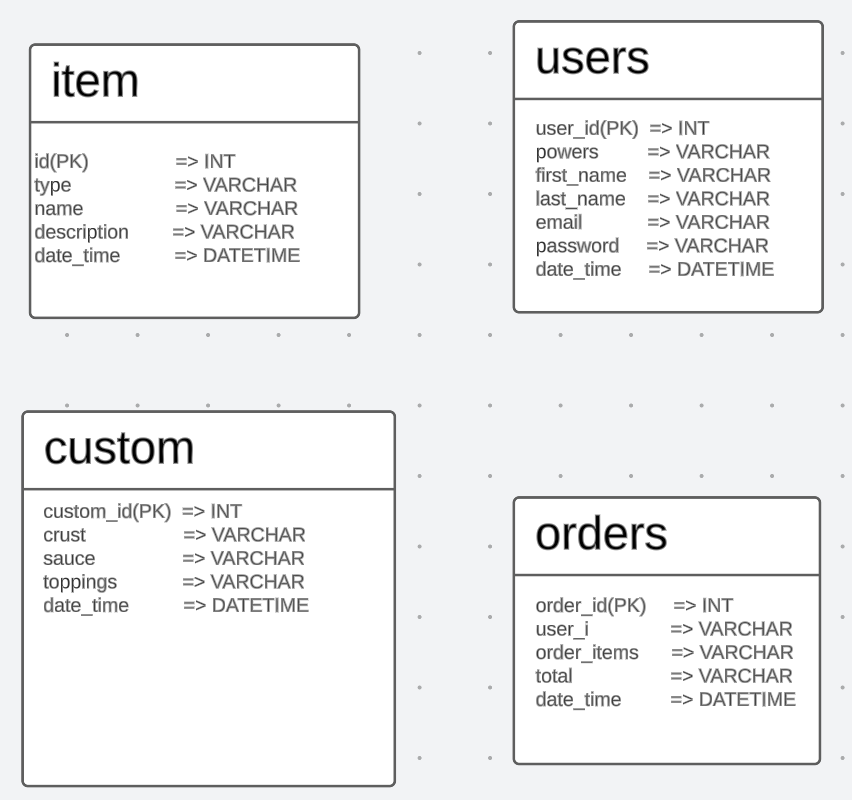

# PizzaPlanet
Pizza Planet - A online webpage for a pizza shop, that implements a log in/ sign up feature that
allows you to either sign in as an admin or guest. Guest have the ability to place an order
based on items that we have in our menu page, or create a custom pizza in our place order
page. All of which will be able to view order in our cart page. Admin are given the ability to
make changes to our mane page as well as add new items to the menu.

## Authors

- Joshua Nakatani - Developer
- Nathan Waters - Developer
- Sam Grigorenko - Developer

## Project Requirements

**1. Separates all database/business logic using the MVC pattern.**
- All HTML files are under the views folder and we implemented and includes includes things
  like our footer header and nav-bar.
- index.php calls function in Controller to get data from the model and return views.
- Routes to all the HTML files are under index.php
- databases and validations are under the model folder
- Classes (items, customPizza, and user) are under the classes folder
- All images as in our Image folder
- Styles folder holds all our code that is responsible for the page styling.
  

  **2. Routes all URLs and leverages a templating language using the Fat-Free
  framework.**
- All routes are in the index.php and are utilizing our controller class
  
**3. Has a clearly defined database layer using PDO and prepared statements.**
- Our data layer is under the model folder and incorporates PDO and has various prepared
  statements.

**4. Data can be added and viewed.**
- Database layer uses PDO and prepared statements to insert and get from the database. This
  can be seen with our cart page that stores user orders as well as with our menu page and

**5. Has a history of commits from all team members to a Git repository. Commits are
  clearly commented.**
- Each teammate(Joshua, Nathan, and Sam) have multiple commits that are well-commented
  in the Git repository.

**6. Uses OOP, and utilizes multiple classes, including at least one inheritance
  relationship.**
- For this Project, we utilized three classes: customPizza, items, and user.
- items contains id, type, name, and description.
- customPizza extends items and contains size, crust, sauce, and topping.
- user contains power, first name, last name, email, and password.
  We use OOP with our menu page as well as in our place order page that allows users to build
  there own pizza, and in our login /sign up page.

**7. Contains full DocBlocks for all PHP files and follows PEAR standards.**
- yes, all files include DocBlocks and follow PEAR standards. This can be seen all through out
  our code.
  
**8. Has full validation on the server side through PHP.**
- User sign-up and log -in and custom pizza form are all validated with PHP and utilize the
  validation file under the model folder.
  
**9. All code is clean, clear, and well-commented. DRY (Don't Repeat Yourself) is
  practiced.**
- True
  
**10. Your submission shows adequate effort for a final project in a full-stack web
  development course.**
- Throughout this quarter we have learned a lot of new techniques and skills surrounding fullstack web development all of which we have been able to work into this project.
  
**BONUS: Incorporates Ajax that access data from a JSON file, PHP script, or API.**
- Our project does not incorporate Ajax.

# UML Class Diagram
- 
# ER Database Diagram

# Github Commit breakdown

